# 📋 Interactive TaskManager

A modern, interactive Task Manager app built with **Jetpack Compose**, **Room Database**, and **Kotlin Coroutines**. Organize your tasks with smart filters, sort options, animations, and accessibility support—all in a clean and intuitive UI.

## ✨ Features

- ✅ Add, edit, complete, and delete tasks
- 🔁 Undo task deletion with a snackbar
- 🗂️ Sort by due date, priority, or alphabetically
- 🔍 Filter by completed or pending tasks
- 🎨 Dynamic theming (Light/Dark + user color preferences)
- ⚙️ Customizable primary theme color from settings
- 💥 Smooth animations: FAB bounce, circular reveal, swipe-to-delete, drag-and-drop reorder
- 📊 Animated circular progress for task completion
- 👨‍🦯 Accessibility support (screen readers, high contrast, keyboard nav, text scaling)
- 🧠 Built with MVVM + Clean Architecture
- ⚡ Reactive UI with Jetpack Compose + StateFlow

## 🛠️ Tech Stack

- **Kotlin**
- **Jetpack Compose**
- **Room Database**
- **StateFlow / MutableStateFlow**
- **Coroutines + ViewModelScope**
- **MVVM Architecture**
- **Material Design 3**
- 
## 🖼️ Screenshots

<table>
  <tr>
    <td>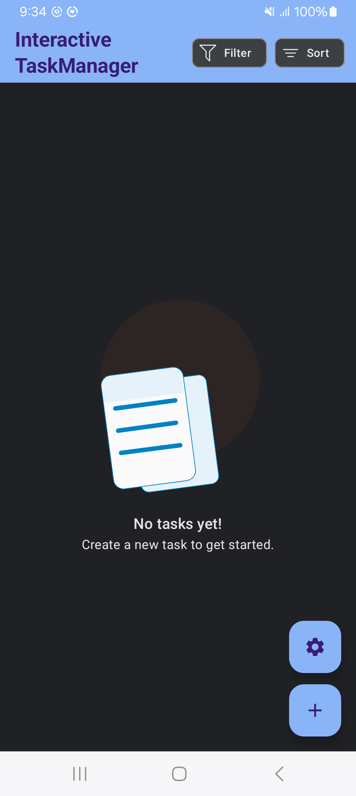</td>
    <td>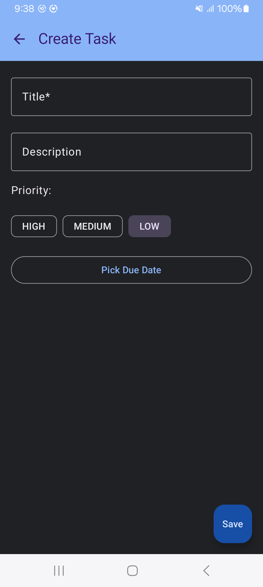</td>
    <td>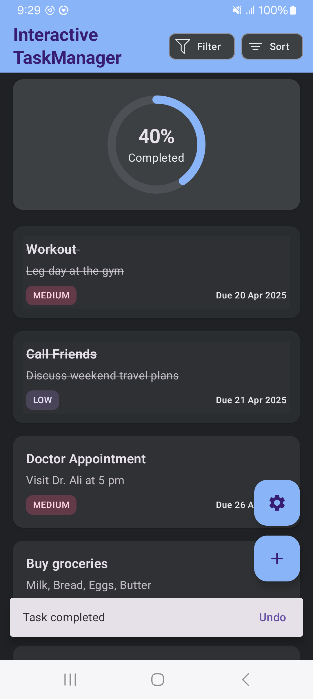</td>
  </tr>
  <tr>
    <td align="center">Home</td>
    <td align="center">Add Task</td>
    <td align="center">Task List</td>
  </tr>
  <tr>
    <td>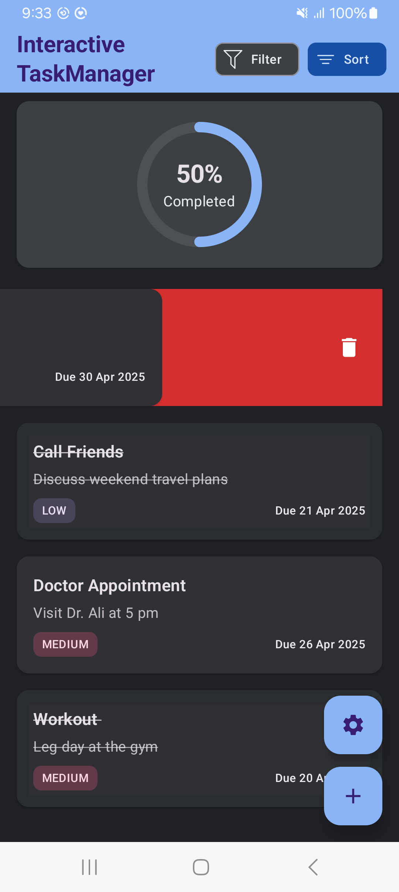</td>
    <td>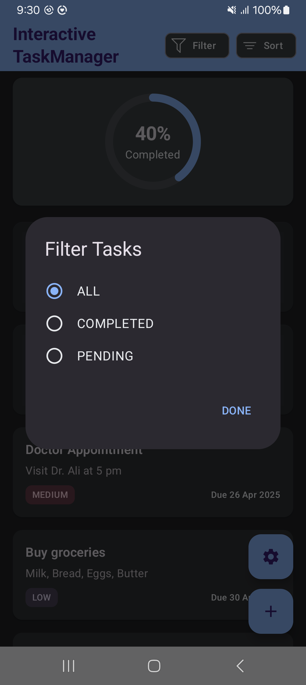</td>
    <td>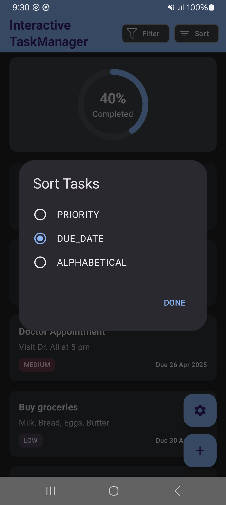</td>
  </tr>
  <tr>
    <td align="center">Delete with Undo</td>
    <td align="center">Filter</td>
    <td align="center">Sort</td>
  </tr>
    <tr>
    <td>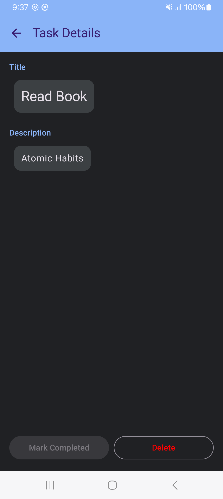</td>
    <td>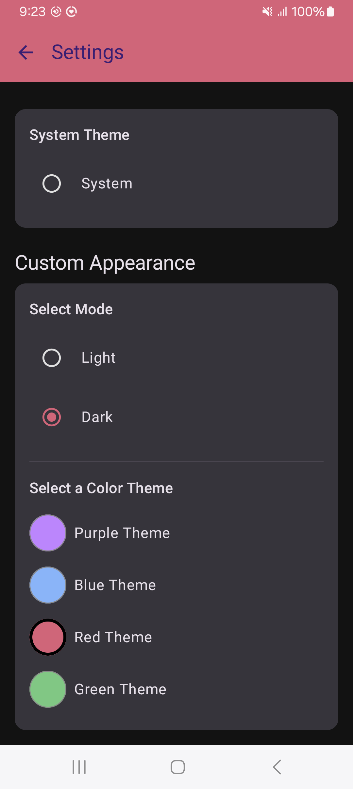</td>
    <td>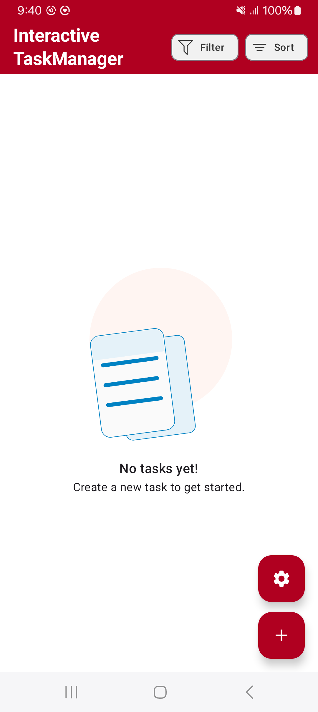</td>
  </tr>
  <tr>
    <td align="center">Task Detail</td>
    <td align="center">Setting</td>
    <td align="center">Home</td>
  </tr>
       <tr>
    <td>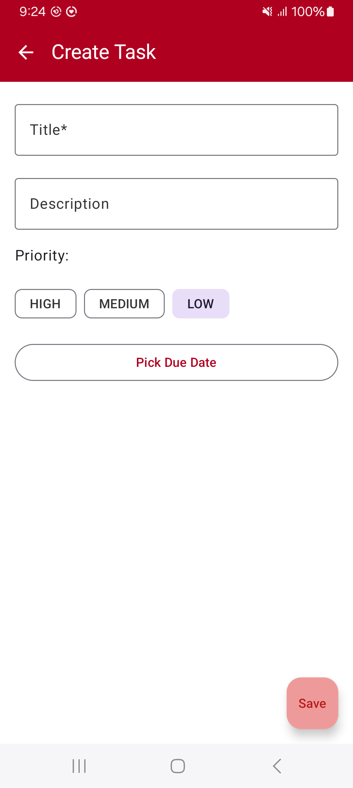</td>
    <td>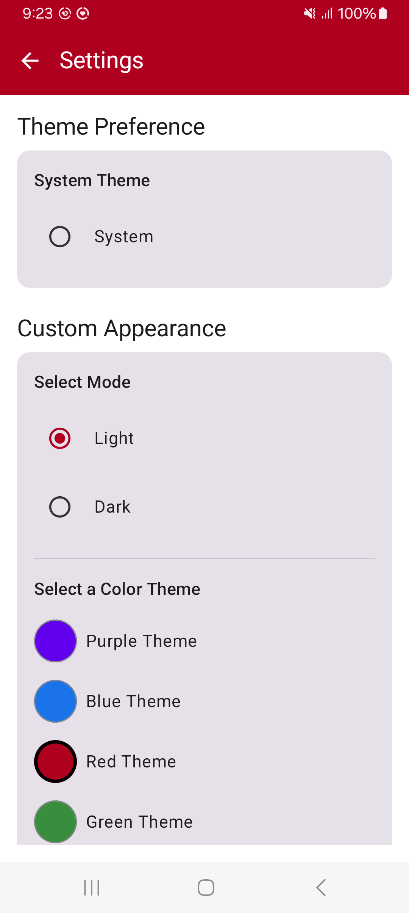</td>
    <td>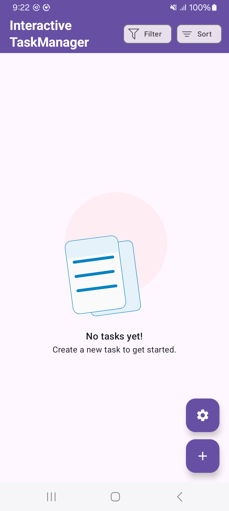</td>
  </tr>
  <tr>
    <td align="center">Add Task</td>
    <td align="center">Setting</td>
    <td align="center">Home</td>
  </tr>
</table>

## 📱 Download & Demo

-  🎥 [Watch the Demo](https://github.com/Ammar-Ishfaq/InteractiveTaskManagerJetpackCompose/tree/main/app/sampledata/sr.mp4)

-  📦 [Download APK](https://github.com/Ammar-Ishfaq/InteractiveTaskManagerJetpackCompose/blob/main/app/sampledata/iTaskManager.apk)

## 🚀 Getting Started

1. Clone the repo:
   ```bash
   git clone https://github.com/Ammar-Ishfaq/InteractiveTaskManagerJetpackCompose.git
   cd InteractiveTaskManagerJetpackCompose
2. Open the project in Android Studio (Hedgehog+ recommended)

3. Build and run on an emulator or physical device (Android 7.0+)


## 🧪 Testing
- Uses kotlinx.coroutines.test for ViewModel testing
- Mock DAO for simulating Room interactions
- Covers add, delete, undo, filter, and reorder logic

## 🙋‍♂️ Author
Ammar Ishfaq\
📧 ammarishfaq25@gmail.com\
🔗 GitHub: github.com/ammar-ishfaq\
💼 LinkedIn: linkedin.com/in/ammar-ishfaq


## 🤝 Contributing
Pull requests are welcome! For major changes, please open an issue first to discuss what you'd like to change.

## 📄 License
This project is licensed under the Apache 2.0 License — see the LICENSE file for details

